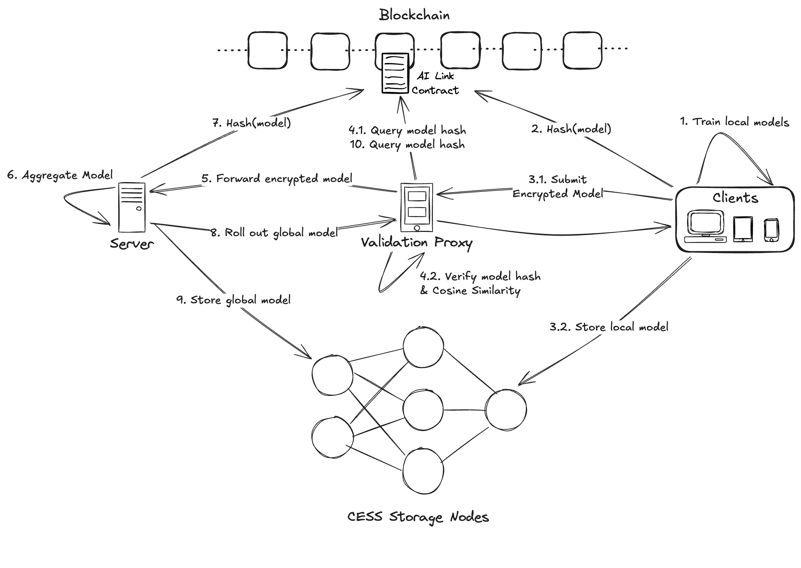

# AI-Link

## Introduction
AI-LINK is a Byzantine-Robust Circuit designed to ensure privacy and data sovereignty. It leverages smart contracts to connect decentralized storage and computing resources, enabling secure AI training and applications while safeguarding the user's original data from exposure.

## Features planned for the Hackathon

- [x] Implement a smart contract to orchestrate AI training schedules and serve as a foundation for models proof of existence.
- [x] Create an aggregation server that combines local models into a global model.
- [x] Create a validation proxy server that verifies the models integrity.
- [x] Create a client that performs local training and submits the model to the server.

## Architecture

## Team info
Kwuaint Lee, Chunshu Dai, Mark Liu

## Material for Demo
1. Demo Video [link to Youtube]
2. PPT [https://docs.google.com/presentation/d/1EbokU6l0DUOa4j9J2_cC8p8TWP2Qci96s1w2Mj8Z_7E/edit?usp=sharing]
3. Website: [https://chunshudai2001.wixsite.com/ai-link]
