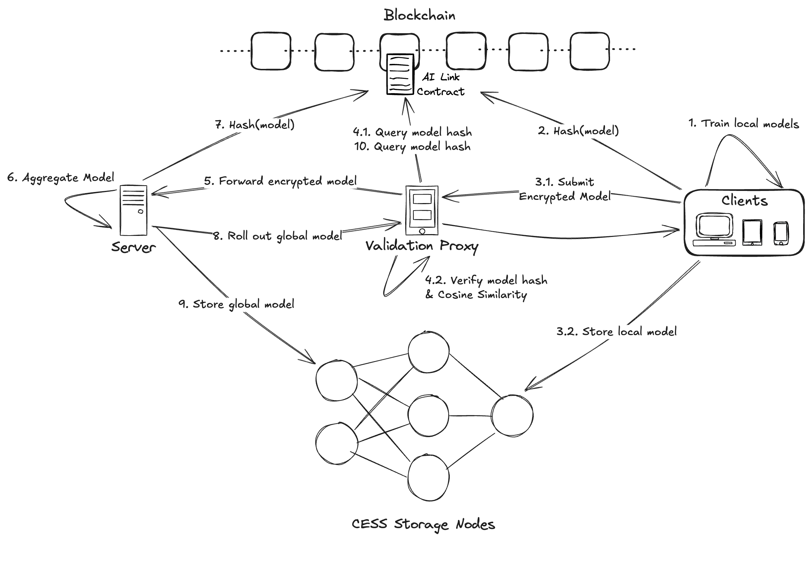

# AI-Link

### **Introduction:**
AI-LINK is a Byzantine-Robust Circuit designed to ensure privacy and data sovereignty. It leverages smart contracts to connect decentralized storage and computing resources, enabling secure AI training and applications while safeguarding the user's original data from exposure.

### **Components:**
1. **Clients**: Represent different devices (e.g., phones, tablets, computers, etc) that train models locally on their data.
2. **Server**: Acts as the central node for aggregating local models into a global model.
3. **Validation Proxy**: A data integrity checkpoint server that ensures confidentiality and integrity of model exchange. (Replace with TEE in the future.)
4. **Blockchain & Smart Contract**: Provides a decentralized and transparent ledger to store and verify the integrity of model updates.
5. **CESS Storage**: A decentralized storage to securely store trained models.

### **Architecture:**

### **Process Overview:**
**1. Train Local Models** 

- Clients (such as computers, smartphones, or IoT devices) train models locally using their private data.
- This ensures that raw data remains on the client side, which enhances privacy and security.

**2. Hash Local Models**

- Once the local models are trained, each model is hashed (i.e., a unique hash value is generated based on the model’s data).
- The hash helps in tracking and validating the models later.

**3.1. Submit Encrypted Model**

- Clients encrypt their local models and submit them to the Validation Proxy.
- This encryption ensures secure transmission.
**3.2. Store Local Models**
- Local models can also be stored in CESS Storage Nodes for backup and decentralized access.

**4.1.; 4.2. Query and Verify Model Hash**

- The Validation Proxy communicates with the Blockchain to query the model hashes to ensure integrity and prevent tampering.
- Additionally, the proxy verifies the hash values and may calculate cosine similarity to compare the new model with previous versions or models to ensure compatibility and performance.

**5. Forward Encrypted Model**

- After validation, the encrypted model is forwarded to the Server.

**6. Aggregate Model**

- The server aggregates the received models from different clients into a global model. This step involves combining the knowledge from multiple local models into a more generalized model.

**7. Hash Global Model**

- The aggregated global model is hashed, and the hash is recorded in the Blockchain to maintain integrity and track the version.

**8. Roll Out Global Model**

- The server rolls out the global model to the Validation Proxy, which ensures that it is properly validated before distributing it back to the clients.

**9. Store Global Model** 

- The global model is stored in CESS Storage Nodes for distributed access and backup.

**10. Query Model Hash**

- The Blockchain can be queried again by the Validation Proxy or other entities to verify the model hash for future operations, ensuring the model's integrity and consistency over time.